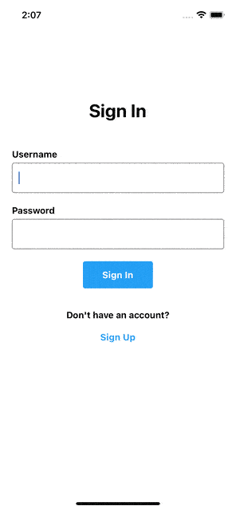
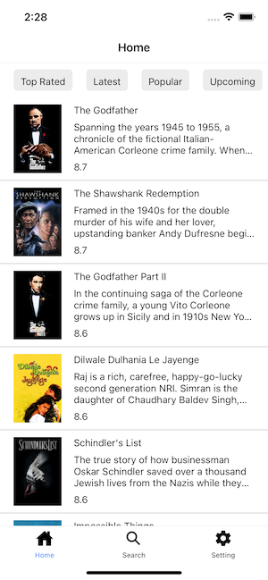

# React Native Movie App

EN - This project is the fourth assignment within the scope of "Akbank React Native Bootcamp" organized by Patika.dev. It includes the sign in and sign up screen, home screen, search screen and settings screens.

TR - Bu proje Patika.dev 'in düzenlediği "Akbank React Native Bootcamp" kapsamında yapılan dördüncü ödevdir. Movie App uygulamasında giriş ve kayıt ekranı, filmlerin listelendiği ana ekran, film arama ekranı ve ayarlar ekranı bulunmaktadır.
<br/><br/>

## Screenshot APP

### Gif



### ScreenShot


<br/>
<br/>

## Technologies


<br/>
<br/>

### Features

- "The Movie Database (TMDB) API version 3" is used in this project. <a href="https://developers.themoviedb.org/3/getting-started/introduction">TMDB API</a>
- Sign in Screen
- Sign up Screen
- Home Screen
- Search Screen
- Setting Screen
- Supports dark/light mode 🌗

### Todo

- Movies rates
- Add movie videos
- Add movie actors
- New additional features to the settings page

## Installation

```
npm install
npm run ios
npm run android
```
